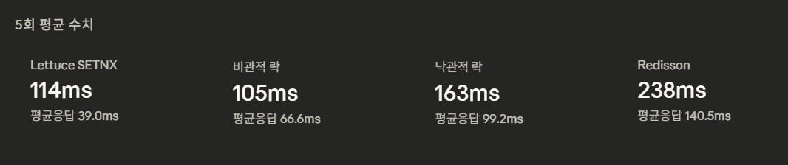
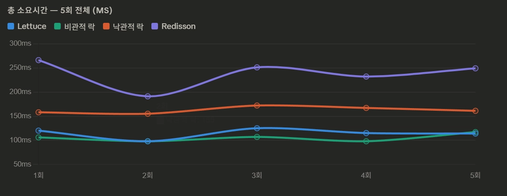
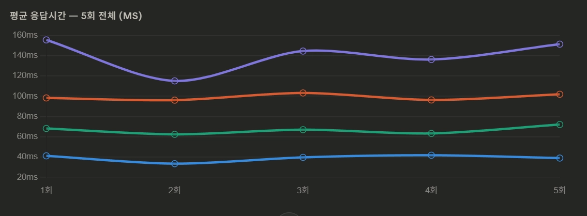
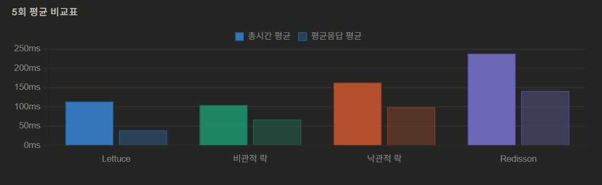

# 🔨 경매 플랫폼 프로젝트

> 한 줄 프로젝트 소개를 여기에 작성하세요.

<br>

## 📌 목차

- [프로젝트 소개](#-프로젝트-소개)
- [팀원 소개](#-팀원-소개)
- [기술 스택](#-기술-스택)
- [주요 기능](#-주요-기능)
- [아키텍처](#-아키텍처)
- [ERD](#-erd)
- [API 명세서](#-api-명세서)
- [프로젝트 구조](#-프로젝트-구조)
- [시작하기](#-시작하기)
- [환경변수 설정](#-환경변수-설정)
- [동시성 테스트](#-동시성-테스트)
- [트러블슈팅](#-트러블슈팅)

<br>

## 📖 프로젝트 소개

> 실시간 경매 시스템을 기반으로 다양한 비즈니스 기능을 확장한 백엔드 프로젝트입니다.
> 
> 본 프로젝트는 실시간 경매 서비스를 중심으로, 사용자들이 경매에 참여하고 입찰하며, 다양한 부가 기능을 이용할 수 있도록 설계된 시스템입니다.

- 개발 기간 : 2026.03.05 ~ 2026.03.25


<br>

## 👥 팀원 소개

| 이름  | 역할                | 담당 기능                       | GitHub |
|-----|-------------------|-----------------------------|--------|
| 김대훈 | Backend, Frontend | 입찰, 동시성 제어, 락 별 성능 테스트, 프론트 | https://github.com/BigMacHun-del |
| 정인호 | Backend           | 이벤트, 쿠폰, 캐싱, Redis Lock     | https://github.com/eNoLJ |
| 유지현 | Backend           | 채팅, 알림                      |https://github.com/jihyeon1346  |
| 조현희 | Backend           | 유저, 인증                      | https://github.com/hhjo96 |
| 정은식 | Backend | 경매, 캐싱, 인덱싱 |https://github.com/S1K1DA  |

<br>

## 🛠 기술 스택

### Backend


### Database & Cache


### Infra & DevOps


### 인증 & 실시간


<br>

## ✨ 주요 기능

### 🏷 경매 (Auction)
- 경매 등록 / 수정 / 삭제 (PENDING 상태에서만 가능, 판매자 본인 검증)
- SELLER 등급 검증, 시작가·최소입찰단위·시작/종료 시간 유효성 검증
- 관리자 승인 기능 (PENDING → READY)
- 경매 상세 조회 (QueryDSL + Redis 조회수 실시간 합산)
- 경매 목록 조회 v1 (기본 JPA) / v2 (QueryDSL + Redis Cache, @Cacheable)
- 등록·수정·삭제 시 @CacheEvict로 캐시 자동 무효화
- Redis ZSet 기반 일일 인기 경매 TOP5 조회
- 조회수 Redis 임시 저장 후 2분마다 DB 동기화 (AuctionViewScheduler)
- 매일 자정 인기 랭킹 초기화 (AuctionRankingScheduler)
- 1분마다 READY 경매 자동 시작 / 만료된 ACTIVE 경매 자동 정산 (AuctionScheduler)
- 시작 10분 전까지 미승인 경매 자동 취소 (Scheduler)
- k6 + Grafana + InfluxDB를 활용한 v1/v2 성능 부하 테스트 및 수치 검증
- 인덱스(idx_auction_start) 설계 및 적용으로 응답시간 91.9% 감소


<details>
  
<summary> 경매 성능 최적화 관련 (Redis Cache & Indexing) </summary>

<details>
<summary> Redis 캐시 — 왜 검색 API에 Cache를 적용했나</summary>

<br>

### 도입 배경

경매 목록 조회 API(`/api/auctions/v2`)는 서비스에서 **가장 빈번하게 호출되는 API** 중 하나입니다.

매 요청마다 DB에 접근하면 다음과 같은 문제가 발생합니다:

- 동일한 조건(키워드, 카테고리, 상태, 페이지)으로 반복 요청 시 **불필요한 DB 부하 발생**
- 트래픽이 몰리는 경매 시작 전후 시간대에 **응답 속도 저하** 우려
- 경매 목록 데이터는 **실시간성이 크게 중요하지 않아** 짧은 TTL의 캐시로 대체 가능

이를 해결하기 위해 **Spring Cache + Redis** 를 활용한 캐싱 전략을 도입했습니다.

---

### 적용 방법

**캐시 저장 — `@Cacheable`**
```java
@Cacheable(
    value = "auctionSearch",
    key = "(#keyword == null ? 'none' : #keyword) + '-' + " +
          "(#category == null ? 'all' : #category) + '-' + " +
          "(#status == null ? 'all' : #status) + '-' + " +
          "#pageable.pageNumber + '-' + #pageable.pageSize"
)
public PageResponse<AuctionListResponse> searchAuctionsV2(...) { ... }
```

**캐시 무효화 — `@CacheEvict`**
```java
// 경매 등록 / 수정 / 삭제 시 캐시 전체 삭제
@CacheEvict(value = "auctionSearch", allEntries = true)
public AuctionCreateResponse createAuction(...) { ... }
```

**캐시 키 설계 전략**
| 구성 요소 | 예시 | 설명 |
|-----------|------|------|
| keyword | `none` or `나이키` | null이면 none으로 처리 |
| category | `all` or `FASHION` | null이면 전체 |
| status | `all` or `ACTIVE` | null이면 전체 |
| pageNumber | `0`, `1` ... | 페이지 번호 |
| pageSize | `20` | 페이지 크기 |

> 예시 캐시 키: `none-all-ACTIVE-0-20`

</details>

---

<details>
<summary> Redis 캐시 — 적용 전/후 성능 비교 결과</summary>

<br>

### 테스트 환경

| 항목 | 내용 |
|------|------|
| 테스트 도구 | k6 |
| 더미 데이터 | 10만 건 |
| VU (가상 유저) | 50명 |
| 테스트 시간 | 30초 |
| 대상 API | 경매 목록 조회 (`/api/auctions/v1` vs `/api/auctions/v2`) |

---

### 성능 비교 결과

| 지표 | v1 (JPA) | v2 (QueryDSL + Redis Cache) | 개선율 |
|------|:--------:|:---------------------------:|:------:|
| 평균 응답시간 | 65.55 ms | 11.82 ms | **↓ 81.9%** |
| P50 (중앙값) | 61.57 ms | 4.56 ms | **↓ 92.6%** |
| P90 | 84.9 ms | 8.43 ms | **↓ 90.1%** |
| P95 | 99.42 ms | 11.11 ms | **↓ 88.8%** |
| 처리량 (TPS) | 46.7 /s | 49.3 /s | ↑ 5.6% |
| 에러율 | 0% | 0% | — |

---

### 테스트 결과 스크린샷

**v1 — 기본 JPA 결과 (k6)**


<br>

**v2 — QueryDSL + Redis Cache 결과 (k6)**


---

### 부하 테스트 (VU 최대 400, 3분)

| 지표 | v1 (JPA) | v2 (QueryDSL + Redis Cache) | 개선율 |
|------|:--------:|:---------------------------:|:------:|
| 평균 응답시간 | 713 ms | 16 ms | **↓ 97.7%** |
| P95 | 1.66 s | 35 ms | **↓ 97.9%** |
| TPS | 270 /s | 10,677 /s | **↑ 39.5배** |
| 총 처리 건수 | 48,635건 | 1,921,868건 | **↑ 39.5배** |

> v2 고부하 테스트 시 Grafana + InfluxDB가 트래픽을 감당하지 못해 k6 단독으로 측정
> (캐시 성능이 로컬 모니터링 인프라의 한계를 초과한 것으로 판단)

**v1 — Grafana 대시보드**


<br>

**v2 — k6 터미널 결과 및 Grafana대시보드 (Grafana 측정 불가)**


</details>

---

<details>
<summary> 인덱싱 최적화 — DDL 쿼리 및 설계 근거</summary>

<br>

### 적용 DDL

```sql
CREATE INDEX idx_auction_start
ON auctions (start_at DESC, id DESC);
```

---

### 컬럼 이유

**대상 쿼리**
```sql
SELECT a.id, u.nickname, a.product_name, ...
FROM auctions a
JOIN users u ON a.seller_id = u.id
WHERE a.status IN ('READY', 'ACTIVE', 'DONE')
ORDER BY a.start_at DESC, a.id DESC
LIMIT 0, 20;
```

**설계 근거**

| 결정 | 이유 |
|------|------|
| `start_at`을 첫 번째 컬럼으로 | `ORDER BY start_at DESC`와 인덱스 순서 일치 → **filesort 제거** |
| `id`를 두 번째 컬럼으로 | 동일 `start_at` 값이 있을 때 정렬 안정성 보장 + **LIMIT 조기 종료(Early Stop)** 가능 |
| `status`를 인덱스에서 제외 | 카디널리티가 낮아 (READY/ACTIVE/DONE 대부분 해당) 인덱스 선택도가 낮음 → 효과 없음 |
| 두 컬럼 모두 `DESC` | 쿼리의 정렬 방향과 완전히 일치시켜 **역방향 스캔 비용 제거** |

</details>

---

<details>
<summary>인덱싱 최적화 — EXPLAIN 분석 및 전/후 성능 비교</summary>

<br>

### EXPLAIN 실행 계획 비교

| 항목 | 인덱스 적용 전 | 인덱스 적용 후 | 개선 내용 |
|------|:------------:|:------------:|---------|
| type | `ALL` | `index` | Full Table Scan → Index Scan |
| key | `NULL` | `idx_auction_start` | 인덱스 사용 |
| rows | `497,147` | `20` | 스캔 rows **99.996% 감소** |
| Extra | `Using where; Using filesort` | `Using where` | **filesort 완전 제거** |


### 인덱스 적용 전/후 비교 (k6, VU 최대 150)

**테스트 환경**

| 항목 | 내용 |
|------|------|
| 테스트 도구 | k6 + Grafana + InfluxDB |
| 더미 데이터 | 50만 건 |
| Stages | 50 → 100 → 150 VU (각 30s) |
| 대상 API | 경매 목록 조회 |

**결과 비교**

| 지표 | 인덱스 전 | 인덱스 후 | 개선 |
|------|:--------:|:--------:|:----:|
| 평균 응답시간 | 3.69 s | 298.78 ms | **↓ 91.9% (약 12.3배 단축)** |
| 처리량 (TPS) | 16.4 /s | 57.4 /s | **↑ 3.5배 증가** |
| rows 스캔 | 497,147 | 20 | **↓ 약 24,847배 감소** |
| filesort | 있음 | 제거 | **정렬 최적화 성공** |

**인덱스 적용 전 — k6 결과**


<br>

**인덱스 적용 전 — Grafana 대시보드**


<br>

**인덱스 적용 후 — k6 결과**


<br>

**인덱스 적용 후 — Grafana 대시보드**


</details>
</details>


### 💰 입찰 (Bid)
- 수동 입찰 및 자동 입찰 기능 제공
- 경매 종료 5분 전 블라인드 입찰 모드 진입 (입찰 금액 비공개)
- Redis 분산 락(Lettuce SETNX)을 이용한 동시성 제어 (즉시 실패 전략)
- 비관적 락 / 낙관적 락 / Redisson 분산 락 방식 구현 및 성능 비교
- 입찰 실패 시 즉시 409 반환으로 빠른 피드백 및 서버 스레드 점유 최소화
- 입찰 목록 조회 (본인 전체 내역 / 특정 경매별 내역)

### 💬 채팅 (Chat)
- STOMP WebSocket 기반 실시간 채팅 구현
- Redis Pub/Sub을 통해 메시지 브로드캐스트
- 채팅방 생성 시 Redis 분산락으로 중복 생성 방지
- 채팅방 입장/퇴장 시 시스템 메시지 자동 발송
- 관리자는 전체 채팅방 조회, 일반 유저는 본인 채팅방만 조회 가능
- 커서 기반 메시지 페이지네이션 (특정 시점 이전 메시지 조회)
- 채팅방 생성 시 관리자에게 문의 접수 알림 자동 발송
- 채팅방 삭제(나가기) 시 접속 중인 유저에게 종료 안내 메시지 실시간 발송

### 🔔 알림 (Alert)
- WebSocket(STOMP)을 통한 실시간 알림 전송 (/sub/alert/{userId})
- Redis를 이용한 중복 알림 방지 (5초 내 동일 알림 재발송 차단)
- 알림 DB 저장 실패 시 Redis 키 즉시 복원하여 재시도 가능하도록 처리
- 경매 종료 5분 전 Blind 모드 진입 시 NEW_BID, OUT_BID 알림 자동 차단
- 알림 읽음 처리 (본인 알림만 처리 가능, 권한 검증 포함)
- 알림 목록 최신순 조회

### 🎫 쿠폰 (Coupon)
- 선착순 쿠폰 발급(Redis 분산 락 적용)
- 쿠폰 사용 및 리워드 적용

### 🎉 이벤트 (Event)
- 기간 기반 이벤트 생성 및 상태 관리
- Redis 캐싱을 통한 목록 조회 성능 개선

### 💎 멤버십 (Membership)
- Enum 기반 멤버십 상태 관리 설계

### 🔐 인증 / 소셜 로그인 (Auth)
- JWT 기반 인증 (Access Token + Refresh Token)
- Spring Security를 통한 인증/인가
- OAuth2 기반 소셜 로그인 (Google / Kakao / Naver)
- 토큰 블랙리스트 처리(redis)

<br>

## 🏗 아키텍처

> 아키텍처 다이어그램을 여기에 첨부하세요.

```
(아키텍처 이미지 또는 다이어그램)
```

<br>

## 📊 ERD


<br>

## 📋 API 명세서

> 🔒 = 인증 필요 (Header: `Authorization: Bearer {accessToken}`)
>
> 모든 응답은 아래 공통 포맷을 따릅니다.
> ```json
> { "success": true, "code": "200", "message": "성공 메시지", "data": { } }
> ```

---

### 🔐 인증 (Auth) `/api/auth`

| Method | URI | 설명 | 인증 |
|--------|-----|------|:----:|
| `POST` | `/api/auth/signup` | 회원가입 | ✗ |
| `POST` | `/api/auth/login` | 로그인 | ✗ |
| `POST` | `/api/auth/logout` | 로그아웃 | 🔒 |
| `POST` | `/api/auth/refresh` | 토큰 재발급 | ✗ |
| `PATCH` | `/api/auth/oauth2/me/google` | Google 소셜 추가정보 입력 | 🔒 |
| `PATCH` | `/api/auth/oauth2/me/kakao` | Kakao 소셜 추가정보 입력 | 🔒 |

<details>
<summary>요청 / 응답 예시 보기</summary>

#### POST `/api/auth/signup` — 회원가입

**Request Body**
```json
{
  "nickname": "홍길동",
  "name": "홍길동",
  "email": "user@example.com",
  "password": "Password1!",
  "phone": "01012345678",
  "userRole": "ROLE_USER",
  "membershipGrade": "NORMAL"
}
```
> - `userRole`: `ROLE_USER` | `ROLE_ADMIN`
> - `membershipGrade`: `NORMAL` | `SELLER`

**Response** `200 OK`
```json
{
  "success": true,
  "code": "200",
  "message": "회원가입 성공",
  "data": {
    "nickname": "홍길동",
    "name": "홍길동",
    "email": "user@example.com"
  }
}
```

---

#### POST `/api/auth/login` — 로그인

**Request Body**
```json
{
  "email": "user@example.com",
  "password": "Password1!"
}
```

**Response** `200 OK`
> Refresh Token은 쿠키로 전달됩니다.
```json
{
  "success": true,
  "code": "200",
  "message": "로그인 성공",
  "data": {
    "accessToken": "eyJhbGciOiJIUzI1NiJ9..."
  }
}
```

---

#### POST `/api/auth/logout` — 로그아웃

**Request Header**
```
Authorization: Bearer {accessToken}
```

**Response** `200 OK`
```json
{
  "success": true,
  "code": "200",
  "message": "로그아웃 성공",
  "data": null
}
```

---

#### POST `/api/auth/refresh` — 토큰 재발급

**Request Cookie**
```
refreshToken={refreshToken}
```

**Response** `200 OK`
```json
{
  "success": true,
  "code": "200",
  "message": "토큰 갱신 성공",
  "data": {
    "accessToken": "eyJhbGciOiJIUzI1NiJ9..."
  }
}
```

---

#### PATCH `/api/auth/oauth2/me/google` — Google 소셜 추가정보 입력

**Request Body**
```json
{
  "phone": "01012345678"
}
```

**Response** `200 OK`
```json
{
  "success": true,
  "code": "200",
  "message": "추가정보 입력 완료",
  "data": {
    "accessToken": "eyJhbGciOiJIUzI1NiJ9...",
    "nickname": "홍길동",
    "phone": "01012345678",
    "email": "user@gmail.com"
  }
}
```

---

#### PATCH `/api/auth/oauth2/me/kakao` — Kakao 소셜 추가정보 입력

**Request Body**
```json
{
  "phone": "01012345678",
  "email": "user@example.com"
}
```

**Response** `200 OK`
```json
{
  "success": true,
  "code": "200",
  "message": "추가정보 입력 완료",
  "data": {
    "accessToken": "eyJhbGciOiJIUzI1NiJ9...",
    "nickname": "홍길동",
    "phone": "01012345678",
    "email": "user@example.com"
  }
}
```

</details>

---

### 👤 사용자 (User) `/api/users`

| Method | URI | 설명 | 인증 |
|--------|-----|------|:----:|
| `GET` | `/api/users/me` | 내 프로필 조회 | 🔒 |
| `PATCH` | `/api/users/me` | 닉네임 변경 | 🔒 |
| `PATCH` | `/api/users/me/password` | 비밀번호 변경 | 🔒 |
| `GET` | `/api/users/me/auctions` | 내가 등록한 경매 목록 | 🔒 |
| `GET` | `/api/users/me/bids` | 내 입찰 내역 | 🔒 |
| `POST` | `/api/users/{userId}/ratings` | 유저 평점 등록 | 🔒 |
| `GET` | `/api/users/me/ratings` | 내 평점 조회 | 🔒 |

<details>
<summary>요청 / 응답 예시 보기</summary>

#### GET `/api/users/me` — 내 프로필 조회

**Response** `200 OK`
```json
{
  "success": true,
  "code": "200",
  "message": "마이페이지 조회 성공",
  "data": {
    "nickname": "홍길동",
    "name": "홍길동",
    "email": "user@example.com",
    "phone": "01012345678",
    "point": 10000,
    "membership": {
      "grade": "NORMAL",
      "expiredAt": "2026-12-31T23:59:59"
    },
    "userRole": "ROLE_USER"
  }
}
```
> - `membership.grade`: `NORMAL` | `SELLER`

---

#### PATCH `/api/users/me` — 닉네임 변경

**Request Body**
```json
{
  "newNickname": "새닉네임"
}
```

**Response** `200 OK`
```json
{
  "success": true,
  "code": "200",
  "message": "닉네임 변경 성공",
  "data": null
}
```

---

#### PATCH `/api/users/me/password` — 비밀번호 변경

**Request Body**
```json
{
  "oldPassword": "OldPassword1!",
  "newPassword": "NewPassword1!"
}
```

**Response** `200 OK`
```json
{
  "success": true,
  "code": "200",
  "message": "비밀번호 변경 성공",
  "data": null
}
```

---

#### GET `/api/users/me/auctions` — 내가 등록한 경매 목록

**Response** `200 OK`
```json
{
  "success": true,
  "code": "200",
  "message": "내 경매 상품 내역 조회 성공",
  "data": [
    {
      "auctionId": 1,
      "productName": "아이폰 15 Pro",
      "imageURL": "https://s3.amazonaws.com/...",
      "startPrice": 500000,
      "status": "ACTIVE",
      "createdAt": "2026-03-01T10:00:00"
    }
  ]
}
```
> - `status`: `PENDING` | `CANCEL` | `READY` | `ACTIVE` | `DONE` | `NO_BID`

---

#### GET `/api/users/me/bids` — 내 입찰 내역

**Response** `200 OK`
```json
{
  "success": true,
  "code": "200",
  "message": "내 입찰 내역 조회 성공",
  "data": [
    {
      "bidId": 10,
      "auctionId": 1,
      "price": 550000,
      "status": "SUCCEEDED",
      "createdAt": "2026-03-15T14:30:00"
    }
  ]
}
```
> - `status`: `SUCCEEDED` | `FAILED`

---

#### POST `/api/users/{userId}/ratings` — 유저 평점 등록

**Request Body**
```json
{
  "score": 5
}
```
> - `score`: 1 ~ 5 (정수)

**Response** `200 OK`
```json
{
  "success": true,
  "code": "200",
  "message": "셀러 평점 등록 성공",
  "data": {
    "reviewerId": 2,
    "sellerId": 1,
    "score": 5
  }
}
```

---

#### GET `/api/users/me/ratings` — 내 평점 조회

**Response** `200 OK`
```json
{
  "success": true,
  "code": "200",
  "message": "내 점수 확인 성공",
  "data": {
    "userId": 1,
    "ratings": 4.5
  }
}
```

</details>

---

### 🏷 경매 (Auction) `/api/auctions`

| Method | URI | 설명 | 인증 |
|--------|-----|------|:----:|
| `POST` | `/api/auctions` | 경매 등록 | 🔒 |
| `PATCH` | `/api/auctions/{auctionId}` | 경매 수정 | 🔒 |
| `DELETE` | `/api/auctions/{auctionId}` | 경매 삭제 | 🔒 |
| `GET` | `/api/auctions/{auctionId}` | 경매 단건 조회 | ✗ |
| `GET` | `/api/auctions/v1` | 경매 목록 조회 (v1) | ✗ |
| `GET` | `/api/auctions/v2` | 경매 목록 조회 (v2, 캐싱) | ✗ |
| `GET` | `/api/auctions/top5` | 인기 경매 Top 5 | ✗ |
| `POST` | `/api/auctions/files/upload` | 경매 이미지 업로드 (S3) | 🔒 |
| `GET` | `/api/auctions/files/download-url` | 이미지 다운로드 URL 조회 | 🔒 |
| `PATCH` | `/admin/auctions/{auctionId}/approve` | 경매 승인 (관리자) | 🔒 |

<details>
<summary>요청 / 응답 예시 보기</summary>

#### POST `/api/auctions` — 경매 등록

**Request Body**
```json
{
  "productName": "아이폰 15 Pro",
  "imageUrl": "https://s3.amazonaws.com/bucket/image.jpg",
  "category": "ELECTRONICS",
  "startPrice": 500000,
  "minimumBid": 10000,
  "startAt": "2026-04-01T10:00:00",
  "endAt": "2026-04-03T10:00:00"
}
```
> - `category`: `CLOTHES` | `ELECTRONICS` | `FOOD`

**Response** `200 OK`
```json
{
  "success": true,
  "code": "200",
  "message": "경매가 등록되었습니다.",
  "data": {
    "auctionId": 1
  }
}
```

---

#### PATCH `/api/auctions/{auctionId}` — 경매 수정

**Request Body**
```json
{
  "productName": "아이폰 15 Pro (수정)",
  "imageUrl": "https://s3.amazonaws.com/bucket/image2.jpg",
  "category": "ELECTRONICS",
  "startPrice": 450000,
  "minimumBid": 5000,
  "startAt": "2026-04-02T10:00:00",
  "endAt": "2026-04-04T10:00:00"
}
```

**Response** `200 OK`
```json
{
  "success": true,
  "code": "200",
  "message": "경매가 수정되었습니다.",
  "data": {
    "auctionId": 1
  }
}
```

---

#### DELETE `/api/auctions/{auctionId}` — 경매 삭제

**Response** `200 OK`
```json
{
  "success": true,
  "code": "200",
  "message": "경매가 삭제되었습니다.",
  "data": {
    "auctionId": 1
  }
}
```

---

#### GET `/api/auctions/{auctionId}` — 경매 단건 조회

**Response** `200 OK`
```json
{
  "success": true,
  "code": "200",
  "message": "경매 조회에 성공했습니다.",
  "data": {
    "auctionId": 1,
    "sellerNickname": "홍길동",
    "productName": "아이폰 15 Pro",
    "imageUrl": "https://s3.amazonaws.com/bucket/image.jpg",
    "category": "ELECTRONICS",
    "status": "ACTIVE",
    "startPrice": 500000,
    "minimumBid": 10000,
    "viewCount": 128,
    "startAt": "2026-04-01T10:00:00",
    "endAt": "2026-04-03T10:00:00"
  }
}
```
> - `status`: `PENDING` | `CANCEL` | `READY` | `ACTIVE` | `DONE` | `NO_BID`

---

#### GET `/api/auctions/v1` — 경매 목록 조회 (v1)

**Query Parameters**
| Parameter | Type | 필수 | 설명 |
|-----------|------|:----:|------|
| `page` | int | ✗ | 페이지 번호 (기본값: 0) |
| `size` | int | ✗ | 페이지 크기 (기본값: 10) |
| `category` | String | ✗ | 카테고리 필터 (`CLOTHES`, `ELECTRONICS`, `FOOD`) |

**Response** `200 OK`
```json
{
  "success": true,
  "code": "200",
  "message": "경매 목록 조회에 성공했습니다.",
  "data": {
    "content": [
      {
        "auctionId": 1,
        "sellerNickname": "홍길동",
        "productName": "아이폰 15 Pro",
        "imageUrl": "https://s3.amazonaws.com/bucket/image.jpg",
        "category": "ELECTRONICS",
        "startPrice": 500000,
        "status": "ACTIVE",
        "startAt": "2026-04-01T10:00:00",
        "endAt": "2026-04-03T10:00:00"
      }
    ],
    "totalElements": 100,
    "totalPages": 10,
    "currentPage": 0,
    "size": 10
  }
}
```

---

#### GET `/api/auctions/top5` — 인기 경매 Top 5

**Response** `200 OK`
```json
{
  "success": true,
  "code": "200",
  "message": "인기 경매 조회에 성공했습니다.",
  "data": [
    {
      "auctionId": 3,
      "sellerNickname": "김판매",
      "productName": "맥북 프로 M3",
      "imageUrl": "https://s3.amazonaws.com/bucket/image.jpg",
      "category": "ELECTRONICS",
      "startPrice": 1000000,
      "status": "ACTIVE",
      "startAt": "2026-04-01T10:00:00",
      "endAt": "2026-04-05T10:00:00"
    }
  ]
}
```

---

#### PATCH `/admin/auctions/{auctionId}/approve` — 경매 승인 (관리자)

**Response** `200 OK`
```json
{
  "success": true,
  "code": "200",
  "message": "경매가 승인되었습니다.",
  "data": {
    "auctionId": 1,
    "status": "READY"
  }
}
```

</details>

---

### 💰 입찰 (Bid) `/api/bids`

| Method | URI | 설명 | 인증 |
|--------|-----|------|:----:|
| `POST` | `/api/bids/{auctionId}` | 입찰 (기본) | 🔒 |
| `POST` | `/api/bids/{auctionId}/lock/pessimistic` | 입찰 (비관적 락) | 🔒 |
| `POST` | `/api/bids/{auctionId}/lock/optimistic` | 입찰 (낙관적 락) | 🔒 |
| `POST` | `/api/bids/{auctionId}/lock/redisson` | 입찰 (Redisson 분산락) | 🔒 |
| `POST` | `/api/bids/{auctionId}/auto` | 자동 입찰 등록 | 🔒 |
| `GET` | `/api/bids/me` | 내 입찰 목록 조회 | 🔒 |
| `GET` | `/api/bids/{auctionId}` | 특정 경매 입찰 목록 조회 | 🔒 |

<details>
<summary>요청 / 응답 예시 보기</summary>

#### POST `/api/bids/{auctionId}` — 입찰

**Request Body**
```json
{
  "price": 550000
}
```

**Response** `200 OK` (일반 입찰)
```json
{
  "success": true,
  "code": "200",
  "message": "입찰이 완료되었습니다.",
  "data": {
    "bidId": 10,
    "auctionId": 1,
    "nickname": "홍길동",
    "price": 550000,
    "message": null,
    "createdAt": "2026-03-23"
  }
}
```

**Response** `200 OK` (종료 5분 전 — Blind 입찰, 금액 비공개)
```json
{
  "success": true,
  "code": "200",
  "message": "입찰 시도가 완료되었습니다.",
  "data": {
    "bidId": 11,
    "auctionId": 1,
    "nickname": "홍길동",
    "price": null,
    "message": "입찰 시도가 완료되었습니다.",
    "createdAt": "2026-03-23"
  }
}
```

---

#### GET `/api/bids/me` — 내 입찰 목록 조회

**Response** `200 OK`
```json
{
  "success": true,
  "code": "200",
  "message": "입찰 목록 조회에 성공했습니다.",
  "data": [
    {
      "bidId": 10,
      "auctionId": 1,
      "price": 550000,
      "status": "SUCCEEDED",
      "createdAt": "2026-03-15T14:30:00"
    }
  ]
}
```
> - `status`: `SUCCEEDED` | `FAILED`

---

#### GET `/api/bids/{auctionId}` — 특정 경매 입찰 목록 조회

**Response** `200 OK`
```json
{
  "success": true,
  "code": "200",
  "message": "입찰 목록 조회에 성공했습니다.",
  "data": [
    {
      "bidId": 10,
      "auctionId": 1,
      "price": 550000,
      "status": "SUCCEEDED",
      "createdAt": "2026-03-15T14:30:00"
    },
    {
      "bidId": 9,
      "auctionId": 1,
      "price": 520000,
      "status": "FAILED",
      "createdAt": "2026-03-15T14:00:00"
    }
  ]
}
```

</details>

---

### 💬 채팅 (Chat & ChatRoom)

| Method | URI | 설명 | 인증 |
|--------|-----|------|:----:|
| `POST` | `/api/chat/rooms` | 채팅방 생성 | 🔒 |
| `GET` | `/api/chat/rooms` | 채팅방 목록 조회 | 🔒 |
| `DELETE` | `/api/chat/rooms/{roomId}` | 채팅방 삭제 | 🔒 |
| `GET` | `/api/messages/before/{roomId}` | 특정 시점 이전 메시지 조회 | 🔒 |
| `GET` | `/api/rooms/{roomId}/messages` | 채팅방 메시지 전체 조회 | 🔒 |
| `SEND` | `/pub/chat/{roomId}` | 메시지 전송 (STOMP) | 🔒 |
| `SUBSCRIBE` | `/sub/chat/{roomId}` | 채팅방 구독 (STOMP) | 🔒 |

<details>
<summary>요청 / 응답 예시 보기</summary>

#### POST `/api/chat/rooms` — 채팅방 생성

**Request Body**
```json
{
  "name": "아이폰 15 Pro 문의방"
}
```

**Response** `200 OK`
```json
{
  "success": true,
  "code": "200",
  "message": "채팅방이 생성되었습니다.",
  "data": {
    "id": 1,
    "name": "아이폰 15 Pro 문의방",
    "createdAt": "2026-03-23T10:00:00"
  }
}
```

---

#### GET `/api/chat/rooms` — 채팅방 목록 조회

**Response** `200 OK`
```json
{
  "success": true,
  "code": "200",
  "message": "채팅방 목록 조회에 성공했습니다.",
  "data": [
    {
      "id": 1,
      "name": "아이폰 15 Pro 문의방",
      "createdAt": "2026-03-23T10:00:00"
    }
  ]
}
```

---

#### DELETE `/api/chat/rooms/{roomId}` — 채팅방 삭제

**Response** `200 OK`
```json
{
  "success": true,
  "code": "200",
  "message": "채팅방이 삭제되었습니다.",
  "data": null
}
```

---

#### GET `/api/rooms/{roomId}/messages` — 채팅방 메시지 전체 조회

**Response** `200 OK`
```json
{
  "success": true,
  "code": "200",
  "message": "메시지 조회에 성공했습니다.",
  "data": [
    {
      "id": 1,
      "message": "안녕하세요, 직거래 가능한가요?",
      "roomId": 1,
      "userId": 2,
      "userName": "홍길동",
      "createdAt": "2026-03-23T10:05:00"
    }
  ]
}
```

---

#### SEND `/pub/chat/{roomId}` — 메시지 전송 (STOMP)

**STOMP Message Body**
```json
{
  "roomId": 1,
  "message": "안녕하세요, 직거래 가능한가요?"
}
```

**STOMP Broadcast** (`/sub/chat/{roomId}`)
```json
{
  "id": 1,
  "message": "안녕하세요, 직거래 가능한가요?",
  "roomId": 1,
  "userId": 2,
  "userName": "홍길동",
  "createdAt": "2026-03-23T10:05:00"
}
```

</details>

---

### 🔔 알림 (Alert) `/api/alerts`

| Method | URI | 설명 | 인증 |
|--------|-----|------|:----:|
| `GET` | `/api/alerts` | 내 알림 목록 조회 | 🔒 |
| `PATCH` | `/api/alerts/{alertId}/read` | 알림 읽음 처리 | 🔒 |

<details>
<summary>요청 / 응답 예시 보기</summary>

#### GET `/api/alerts` — 내 알림 목록 조회

**Response** `200 OK`
```json
{
  "success": true,
  "code": "200",
  "message": "알림 목록 조회에 성공했습니다.",
  "data": [
    {
      "alertId": 1,
      "auctionId": 1,
      "userId": 2,
      "alertType": "NEW_BID",
      "message": "새로운 입찰",
      "isRead": false,
      "createdAt": "2026-03-23T10:10:00"
    }
  ]
}
```
> - `alertType`: `NEW_BID` | `OUT_BID` | `AUCTION_END_SOON` | `AUCTION_END` | `AUCTION_WIN` | `SUPPORT_REQUEST`

---

#### PATCH `/api/alerts/{alertId}/read` — 알림 읽음 처리

**Response** `200 OK`
```json
{
  "success": true,
  "code": "200",
  "message": "알림이 읽음 처리 되었습니다.",
  "data": null
}
```

</details>

---

### 🎉 이벤트 (Event) `/api/events`

| Method | URI | 설명 | 인증 |
|--------|-----|------|:----:|
| `POST` | `/api/events` | 이벤트 생성 | 🔒 |
| `GET` | `/api/events` | 이벤트 목록 조회 | ✗ |
| `GET` | `/api/events/{eventId}` | 이벤트 단건 조회 | ✗ |
| `PATCH` | `/api/events/{eventId}` | 이벤트 수정 | 🔒 |
| `DELETE` | `/api/events/{eventId}` | 이벤트 삭제 | 🔒 |

<details>
<summary>요청 / 응답 예시 보기</summary>

#### POST `/api/events` — 이벤트 생성

**Request Body**
```json
{
  "eventName": "신규 가입 환영 이벤트",
  "eventDescription": "신규 가입 시 포인트 쿠폰 지급",
  "totalQuantity": 100,
  "rewardType": "POINT",
  "startAt": "2026-04-01T00:00:00",
  "endAt": "2026-04-30T23:59:59"
}
```
> - `rewardType`: `POINT` | `MEMBERSHIP`

**Response** `200 OK`
```json
{
  "success": true,
  "code": "200",
  "message": "이벤트가 생성되었습니다.",
  "data": {
    "id": 1,
    "eventName": "신규 가입 환영 이벤트",
    "eventDescription": "신규 가입 시 포인트 쿠폰 지급",
    "totalQuantity": 100,
    "issuedQuantity": 0,
    "rewardType": "POINT",
    "startAt": "2026-04-01T00:00:00",
    "endAt": "2026-04-30T23:59:59",
    "status": "OPEN",
    "adminId": 1
  }
}
```

---

#### GET `/api/events` — 이벤트 목록 조회

**Query Parameters**
| Parameter | Type | 필수 | 설명 |
|-----------|------|:----:|------|
| `page` | int | ✗ | 페이지 번호 (기본값: 0) |
| `size` | int | ✗ | 페이지 크기 (기본값: 10) |

**Response** `200 OK`
```json
{
  "success": true,
  "code": "200",
  "message": "이벤트 목록 조회에 성공했습니다.",
  "data": {
    "events": [
      {
        "eventId": 1,
        "eventName": "신규 가입 환영 이벤트",
        "eventDescription": "신규 가입 시 포인트 쿠폰 지급",
        "totalQuantity": 100,
        "issuedQuantity": 20,
        "remainingQuantity": 80,
        "rewardType": "POINT",
        "startAt": "2026-04-01T00:00:00",
        "endAt": "2026-04-30T23:59:59",
        "status": "OPEN"
      }
    ],
    "currentPage": 0,
    "size": 10,
    "totalPages": 1,
    "totalElements": 1,
    "last": true
  }
}
```

---

#### GET `/api/events/{eventId}` — 이벤트 단건 조회

**Response** `200 OK`
```json
{
  "success": true,
  "code": "200",
  "message": "이벤트 조회에 성공했습니다.",
  "data": {
    "id": 1,
    "eventName": "신규 가입 환영 이벤트",
    "eventDescription": "신규 가입 시 포인트 쿠폰 지급",
    "totalQuantity": 100,
    "issuedQuantity": 20,
    "rewardType": "POINT",
    "startAt": "2026-04-01T00:00:00",
    "endAt": "2026-04-30T23:59:59",
    "status": "OPEN",
    "adminId": 1
  }
}
```

---

#### PATCH `/api/events/{eventId}` — 이벤트 수정

**Request Body**
```json
{
  "eventName": "신규 가입 환영 이벤트 (수정)",
  "eventDescription": "포인트 및 멤버십 쿠폰 지급",
  "totalQuantity": 200,
  "rewardType": "MEMBERSHIP",
  "startAt": "2026-04-01T00:00:00",
  "endAt": "2026-05-31T23:59:59",
  "status": "OPEN"
}
```
> - `status`: `OPEN` | `CLOSED`

**Response** `200 OK`
```json
{
  "success": true,
  "code": "200",
  "message": "이벤트가 수정되었습니다.",
  "data": {
    "id": 1,
    "eventName": "신규 가입 환영 이벤트 (수정)",
    "eventDescription": "포인트 및 멤버십 쿠폰 지급",
    "totalQuantity": 200,
    "issuedQuantity": 20,
    "rewardType": "MEMBERSHIP",
    "startAt": "2026-04-01T00:00:00",
    "endAt": "2026-05-31T23:59:59",
    "status": "OPEN",
    "adminId": 1
  }
}
```

---

#### DELETE `/api/events/{eventId}` — 이벤트 삭제

**Response** `200 OK`
```json
{
  "success": true,
  "code": "200",
  "message": "이벤트가 삭제되었습니다.",
  "data": null
}
```

</details>

---

### 🎫 쿠폰 (Coupon)

| Method | URI | 설명 | 인증 |
|--------|-----|------|:----:|
| `POST` | `/api/events/{eventId}/coupons` | 쿠폰 발급 | 🔒 |
| `POST` | `/api/coupons/{couponId}/use` | 쿠폰 사용 | 🔒 |

<details>
<summary>요청 / 응답 예시 보기</summary>

#### POST `/api/events/{eventId}/coupons` — 쿠폰 발급

**Response** `200 OK`
```json
{
  "success": true,
  "code": "200",
  "message": "쿠폰이 발급되었습니다.",
  "data": {
    "couponId": 5,
    "eventId": 1,
    "userId": 2,
    "status": "UNUSED",
    "issuedAt": "2026-04-10T15:00:00"
  }
}
```
> - `status`: `UNUSED` | `USED`

---

#### POST `/api/coupons/{couponId}/use` — 쿠폰 사용

**Response** `200 OK`
```json
{
  "success": true,
  "code": "200",
  "message": "쿠폰이 사용되었습니다.",
  "data": {
    "couponId": 5,
    "status": "USED",
    "rewardType": "POINT",
    "usedAt": "2026-04-15T10:30:00",
    "userId": 2,
    "eventId": 1
  }
}
```
> - `rewardType`: `POINT` | `MEMBERSHIP`

</details>

---

### ⚠️ 공통 에러 응답

| HTTP Status | 설명 |
|-------------|------|
| `400 Bad Request` | 잘못된 요청 (유효성 검사 실패 등) |
| `401 Unauthorized` | 인증 실패 (토큰 없음 / 만료) |
| `403 Forbidden` | 권한 없음 |
| `404 Not Found` | 리소스 없음 |
| `409 Conflict` | 중복 데이터 |
| `500 Internal Server Error` | 서버 오류 |

```json
{
  "success": false,
  "code": "400",
  "message": "이메일 형식이 올바르지 않습니다.",
  "data": null
}
```

<br>

## 🗂 프로젝트 구조

```
src/main/java/sparta/auction_team_project/
├── common/
│   ├── config/          # JPA, QueryDSL, Redis, WebSocket, Security 설정
│   ├── constants/       # 공통 상수
│   ├── dto/             # 공통 DTO (이벤트 객체 등)
│   ├── entity/          # BaseEntity
│   ├── eventlistener/   # 경매 종료, 입찰, 채팅 이벤트 리스너
│   ├── exception/       # 전역 예외 처리
│   ├── interceptor/     # STOMP 인증 인터셉터
│   ├── jwt/             # JWT 유틸, 리프레시 토큰, 블랙리스트
│   ├── oauth2/          # Google / Kakao / Naver OAuth2 처리
│   ├── redis/           # Redis Pub/Sub, 분산락, 캐시
│   ├── response/        # 공통 응답 형식
│   ├── s3/              # S3 파일 업로드/다운로드
│   ├── security/        # Spring Security 설정, 필터, 소셜 로그인
│   └── util/            # 유틸리티
└── domain/
    ├── alert/           # 알림
    ├── auction/         # 경매
    ├── auth/            # 인증
    ├── bid/             # 입찰
    ├── bidlog/          # 입찰 로그
    ├── chat/            # 채팅 메시지
    ├── chatroom/        # 채팅방
    ├── coupon/          # 쿠폰
    ├── event/           # 이벤트
    ├── memberShip/      # 멤버십
    └── user/            # 사용자
```

<br>

## 🚀 시작하기

### 사전 요구사항

- Java 17 이상
- Docker & Docker Compose
- MySQL
- Redis

### 실행 방법

```bash
# 1. 레포지토리 클론
git clone https://github.com/your-repo/auction-team-project.git
cd auction-team-project

# 2. 환경변수 설정
cp .env.example .env
# .env 파일에 필요한 값 입력

# 3. Docker로 의존 서비스 실행
docker-compose up -d

# 4. 애플리케이션 빌드 & 실행
./gradlew bootRun
```

<br>

## ⚙ 환경변수 설정

```env
# Database
DB_URL=
DB_USERNAME=
DB_PASSWORD=

# Redis
REDIS_HOST=
REDIS_PORT=

# JWT
JWT_SECRET=
JWT_ACCESS_EXPIRATION=
JWT_REFRESH_EXPIRATION=

# OAuth2 - Google
GOOGLE_CLIENT_ID=
GOOGLE_CLIENT_SECRET=

# OAuth2 - Kakao
KAKAO_CLIENT_ID=
KAKAO_CLIENT_SECRET=

# OAuth2 - Naver
NAVER_CLIENT_ID=
NAVER_CLIENT_SECRET=

# AWS S3
AWS_ACCESS_KEY=
AWS_SECRET_KEY=
AWS_S3_BUCKET=
AWS_REGION=
```

<br>

## 🛡️ 동시성 테스트

<details>
<summary>분산 락(Lettuce, Redisson), 비관적 락, 낙관적 락 테스트 코드 결과 분석</summary>





## 주목할 포인트

**1. Lettuce vs 비관적 락의 총시간 역전**

1회차에서는 비관적 락(134ms)이 Lettuce(136ms)보다 2ms 빨랐고, 2~3회차에서는 Lettuce가 앞섰다. 오차 범위 안의 차이라 사실상 동일하다고 볼 수 있다. 단, 평균 응답시간은 Lettuce(44ms)가 비관적 락(76ms)보다 일관되게 빠르다.

총시간이 비슷한 이유는 둘 다 직렬화 구조라 병렬 처리 이득이 없기 때문이고, 평균 응답이 다른 이유는 비관적 락이 DB row lock 대기 시간을 각 스레드가 부담하기 때문이다.

**2. 낙관적 락의 재시도 비용**

충돌이 많은 환경(동시 20명)에서 낙관적 락은 재시도 루프가 반복되어 178ms로 Lettuce보다 54ms 느리다. 충돌이 거의 없는 환경이었다면 오히려 가장 빠른 락이 됐을 것이다.

---

**Lettuce가 Redisson보다 빠른데 왜 Redisson을 쓰는가**
테스트 환경(동시 20명, 같은 금액)에서는 어차피 1명만 성공하므로 Redisson의 대기가 낭비처럼 보인다. 하지만 실제 경매 환경에서는 다르다.

실제로는 입찰자들이 **서로 다른 금액**으로 입찰한다. 이 경우 Lettuce는 락을 못 잡은 사람이 즉시 409를 받지만, Redisson은 순서대로 처리되면서 금액이 다르면 모두 성공할 수 있다. 즉 Redisson은 **불필요한 실패를 줄이는 구조**이다. → 사용자 편의성 상승

또한 Lettuce의 폴링 방식(락이 없으면 즉시 실패)은 클라이언트가 재시도를 직접 구현해야 하는 반면, Redisson은 내부적으로 이벤트 기반 재시도를 처리해준다. 클라이언트 코드가 단순해진다.

정리하면 Lettuce는 "빠른 응답, 높은 실패율"이고 Redisson은 "느린 응답, 낮은 실패율"이다. 즉시 실패 후 재입찰이 자연스러운 경매 도메인에서는 Lettuce가 적합하고, 실패를 최소화해야 하는 선착순 쿠폰 발급 같은 도메인에서는 Redisson이 더 적합하다.


</details>

<details>
<summary>비관적 / 낙관적 / 분산 락 비교 분석 및 선택 근거</summary>


## 3가지 락 방식 비교 분석

### 3가지 락 개념

낙관적 락은 JPA(Hibernate)가 관리한다. `@Version` 어노테이션을 엔티티에 선언하면 Hibernate가 UPDATE 쿼리에 `WHERE version = ?` 조건을 자동으로 추가하고, 커밋 시점에 version 불일치가 감지되면 `OptimisticLockingFailureException`을 던진다. DB 자체는 아무것도 모르고, 애플리케이션 레벨에서 충돌을 감지하는 구조이다.

비관적 락은 DB가 관리한다. `SELECT ... FOR UPDATE` 쿼리가 실행되는 순간 DB 엔진이 해당 row에 배타락을 걸고, 트랜잭션이 끝날 때까지 다른 트랜잭션의 접근을 차단한다. 애플리케이션이 아닌 DB가 직접 동시성을 제어한다.

분산 락은 Redis 같은 외부 시스템이 관리한다. 비즈니스 로직 실행 전에 Redis에 락 키를 선점하고, 로직이 끝난 후 키를 해제한다. DB와 무관하게 동작하므로 여러 서버 인스턴스가 동일한 Redis를 바라보는 구조에서 자연스럽게 분산 환경을 지원한다.

---

### 보호 범위

낙관적 락은 DB 커밋 시점의 단일 엔티티만 보호한다. UPDATE가 실행되는 순간에만 version 충돌을 검사하므로, 비즈니스 로직 전체(잔액 차감, 입찰 저장 등)가 실행된 후에야 충돌을 알게 된다. 충돌이 감지되면 이미 실행된 로직 전체를 롤백하고 재시도해야 한다.

비관적 락은 트랜잭션 내 특정 row를 보호한다. `findByIdWithPessimisticLock()`을 호출하는 순간부터 트랜잭션이 끝날 때까지 해당 row에 대한 다른 트랜잭션의 접근이 차단된다. 보호 범위가 명확하고 충돌 자체가 발생하지 않는다.

분산 락은 비즈니스 로직 전체를 보호한다. 락을 잡은 후 잔액 확인, 입찰 처리, Redis 업데이트까지 모든 로직이 직렬화된다. DB 트랜잭션 범위를 넘어서는 Redis 연산까지 포함한 전체 흐름을 보호할 수 있다는 점이 다른 두 방식과의 결정적인 차이이다.

---

### 성능 특성

아래는 BIDLY 프로젝트에서 동시 20명 기준으로 측정한 실제 수치이다(5회 평균).

| 락 방식 | 총 소요시간 | 평균 응답시간 | TPS |
| --- | --- | --- | --- |
| Lettuce (분산 락) | 114ms | 39ms | 8.8 |
| 비관적 락 | 105ms | 67ms | 9.5 |
| 낙관적 락 | 163ms | 99ms | 6.2 |
| Redisson (분산 락) | 238ms | 141ms | 4.3 |

총 소요시간은 비관적 락(105ms)이 Lettuce(114ms)보다 9ms 앞선다. 단, 평균 응답시간은 Lettuce가 39ms, 비관적 락이 67ms로 약 1.7배 차이가 난다. 비관적 락은 DB row lock 대기 시간이 각 스레드 응답에 포함되기 때문이다. 총시간 기준으로는 비관적 락이 근소하게 유리하지만, 이는 로컬 단일 서버 환경에서의 수치이며 실 서비스에서 DB 서버와 애플리케이션 서버가 분리되면 이 관계가 역전될 가능성이 높다.

낙관적 락은 충돌이 많은 환경에서 재시도 루프가 반복되어 총시간 163ms, 평균 응답 99ms로 중간 성능을 기록한다. Redisson은 `waitTime = 3s` 설정으로 인해 소규모 테스트에서 총시간 238ms로 가장 느리지만, 실제로는 409 에러 발생률이 가장 낮다는 장점이 있다.

---

### 적용 시나리오

낙관적 락은 서버 1대 + 충돌이 드문 환경에 적합하다. 입찰자가 순차적으로 들어오는 한적한 경매, 유저 프로필 수정처럼 동시 수정 가능성이 낮은 기능이 해당된다. 충돌이 예외적인 상황이라는 전제가 성립할 때만 유리하다.

비관적 락은 서버 1대 + 충돌이 잦은 환경에 적합하다. Redis 없이 DB만으로 동시성을 제어해야 하는 경우 등과 같을 때 선택한다. 단, 서버를 여러 대로 늘리면 DB connection 점유가 병목이 되므로 확장성에 한계가 있다.

분산 락(Lettuce / Redisson)은 Scale-out 환경에서 필수이다. 서버 인스턴스가 2대 이상이 되는 순간 비관적 락과 낙관적 락은 인스턴스 간 동시성을 보장하지 못한다. Redis라는 단일 진입점을 통해 모든 인스턴스가 동일한 락 상태를 공유하므로, 서버가 10대로 늘어나도 동시성 제어가 동일하게 동작한다.

---

## 최종 선택: 분산 락 (Lettuce)

### 선택 이유

경매 플랫폼은, 마감 직전에 다수의 입찰자가 동시에 몰리는 트래픽 패턴을 가진다. 이 특성을 기준으로 3가지 락을 평가했을 때 Lettuce가 가장 적합하다는 결론을 내렸다.

첫째, 경매 도메인에서 입찰 실패는 비즈니스적으로 자연스러운 상황이다. 락 획득에 실패한 사용자는 더 높은 금액으로 재입찰하면 된다. 따라서 실패 시 즉시 409를 반환하는 즉시 실패(Fail Fast) 전략이 대기 없이 빠른 피드백을 제공하면서 서버 스레드도 점유하지 않는 최선의 선택이다.

둘째, 5회 측정에서 비관적 락의 총시간(105ms)이 Lettuce(114ms)보다 9ms 앞섰지만 평균 응답시간은 Lettuce(39ms)가 비관적 락(67ms)보다 1.7배 빠르다. 사용자가 체감하는 성능은 총시간이 아닌 평균 응답시간이므로 Lettuce가 실질적으로 유리하다. 또한 총시간의 9ms 차이는 로컬 단일 서버 환경에서 DB 캐시와 JVM 최적화가 누적된 결과이며, 실 서비스 환경에서는 역전될 가능성이 높다.

셋째, 향후 서버를 Scale-out할 경우 비관적 락과 낙관적 락은 구조적으로 분산 환경을 지원할 수 없다. Redis 기반 분산 락은 인스턴스가 늘어나도 동일하게 동작하므로 확장성을 확보할 수 있다.


</details>


<details>
<summary>낙관적 락 생각할 것</summary>

## 질문 1. 어떤 상황에서 낙관적 락이 더 유리한가

핵심은 **충돌 빈도**이다. 낙관적 락은 "충돌이 나면 그때 처리하자"는 전략이라 평상시에는 DB lock 없이 그냥 읽고 쓰기만 하므로 오버헤드가 거의 없다.

테스트 결과에서 동시 20명 환경(충돌 많음)에서 낙관적 락이 178ms로 Lettuce(124ms)보다 느렸는데, 이걸 반대로 뒤집으면 "충돌이 거의 없었다면 가장 빠른 락이었을 것"이라는 근거가 된다. version 컬럼 조회는 `findById` 하나에 포함되고, UPDATE 한 번에 version 검사가 끝난다. Redis 통신도, DB row lock도 없다.

구체적으로 낙관적 락이 유리한 상황은 이렇다.

같은 경매에 동시에 달려드는 인기 경매가 아니라, 입찰자가 1~2명씩 순차적으로 들어오는 한적한 경매이다. 또는 상품 조회, 유저 프로필 수정처럼 같은 row를 동시에 수정할 가능성이 낮은 기능도 해당된다. 이런 상황에서는 비관적 락처럼 매번 `SELECT FOR UPDATE`로 row를 잠그는 비용이 오히려 낭비이다.

반면 마감 직전 경매처럼 동시 접근이 집중되는 환경에서는 재시도가 폭발적으로 늘어나 역효과가 난다. 이번 테스트가 그 증거이다.

---

## 질문 2. 재시도 횟수와 backoff는 어떻게 설정할 것인가

현재 코드에서는 `MAX_RETRY = 3`, `RETRY_DELAY = 100ms`로 설정했다.

```java
Thread.sleep(OPTIMISTIC_RETRY_DELAY * attempt); // 100ms, 200ms, 300ms
```

이 수치를 선택한 근거를 테스트 결과로 설명할 수 있다. 낙관적 락의 평균 응답시간이 116ms였고 최대가 201ms였다. 재시도 간격을 100ms로 설정하면 1회 재시도 후 다음 시도까지 최소 100ms를 기다리는데, 이 시간 안에 앞선 트랜잭션이 커밋을 완료할 수 있다. 만약 backoff 없이 즉시 재시도하면 version 충돌이 연속으로 발생해서 재시도가 의미 없어진다.

재시도를 3회로 제한한 이유는 경매 특성 때문이다. 입찰은 "더 높은 금액"이라는 비즈니스 조건이 충족되어야 성공한다. 재시도를 10번 한다고 해도 현재 최고가를 이미 다른 사람이 올려버린 상황이라면 어차피 낮은 가격이라 입찰에 실패한다. 3회면 충분하고, 그 이상은 사용자 응답만 늦어지기 때문에 3회로 설정했다.

실무에 적용 시킬 때 가장 중요한 건, 사용자의 편의성일 것이다. 지금 재시도 횟수를 3번 설정했고, 이 테스트에서 평균 116ms × 3회 = 약 350ms로, 사용자가 체감하기에 0.35초는 크게 느리게 생각하지 않을 것이다.

---

## 질문 3. 충돌이 잦은 환경에서 왜 성능 저하가 발생하는가

테스트 수치가 직접적인 증거이다.

동시 20명이 같은 경매에 같은 가격으로 동시에 입찰하자 낙관적 락은 178ms가 걸렸고, Lettuce SETNX는 124ms였다. 54ms 차이가 나는 이유를 흐름으로 설명하면 이렇다.

20개 트랜잭션이 동시에 `version = 0`인 auction을 읽는다. 커밋 시점에 `UPDATE ... WHERE version = 0`을 시도하는데, 첫 번째만 성공하고 나머지 19개는 `OptimisticLockingFailureException`이 발생한다. 19개가 각각 `REQUIRES_NEW` 트랜잭션으로 재시도를 시작한다. 이 과정에서 DB에 추가 SELECT와 UPDATE가 19번씩 더 발생한다. 재시도 후에도 이미 최고가가 올라가 있어 결국 실패한다.

결국 낙관적 락은 충돌이 많으면 "충돌 감지 → 롤백 → 재시도 → 또 충돌 → 또 재시도"의 루프가 반복되면서 아무런 락 없이 처음부터 실패를 처리하는 Lettuce보다 오히려 DB 부하가 높아진다. Lettuce는 락을 잡지 못하면 즉시 반환하므로 DB에 쿼리 자체가 도달하지 않지만, 낙관적 락은 실패해도 일단 쿼리가 실행된다.

낙관적 락의 전제 조건은 충돌이 예외적인 상황이라는 가정이며, 그 가정이 깨지는 순간 오히려 가장 비효율적인 락이 된다고 말할 수 있다.

</details>

<br>

## 🔧 트러블슈팅

> 개발하면서 마주친 주요 문제와 해결 과정을 기록하세요.

| 문제 | 원인 | 해결 방법 |
|------|------|----------|
| 선착순 쿠폰 발급 시 초과 발급 발생 | 선착순 쿠폰 발급 시 초과 발급 발생 | Redis 분산 락을 적용하여 eventId 기준으로 임계 구역을 설정하고 동시성 제어 |
| 이벤트 목록 조회 성능 저하 | 동일 데이터 반복 조회로 DB 부하 증가 | Redis Cache-Aside 전략 적용 및 TTL 설정으로 조회 성능 개선 |
| 소셜 로그인 후 필수값 누락 | 소셜 로그인 제공자별로 정보제공 범위가 다름 | 제공자별 추가 정보 입력 api 분리 |
| 채팅방 삭제 시 실패하여 롤백되어도 채팅 종료 메세지 나옴 | deleteRoom() 트랜잭션 도중 chatRedisPublisher.publish() 직접 호출. Redis는 트랜잭션 대상이 아니므로 DB가 롤백돼도 이미 나간 메시지는 회수 불가. 삭제 중 race condition으로 다른 사용자가 메시지를 전송하는 문제도 존재 | ChatRoomClosedEvent 도입 + @TransactionalEventListener(AFTER_COMMIT). DB 커밋이 완전히 확정된 이후에만 Redis 메시지 발행. |
